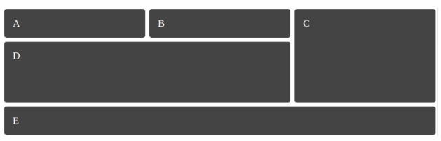

# DIW exercises

In this repository I will storing DIW exercises, each task will be in a different branch.

DIW stands for *Diseny d'Interficies Web*

In the issues section will be doubts and questions for the teacher.

###### Teacher @classicoman2

###### Jose María Samos Diago

[Resources](docs/base.zip)

## Simple responsive grid

Given the HTML and CSS in exercise2.html, add a single line of CSS to obtain [this flexible layout](https://www.useloom.com/share/d0629cc4c4614d34bb8de52e257035c4). 
The gap between items of the grid is of 10 pixels

## Defining grid areas

Given the HTML and CSS in exercise3.html, change the CSS to obtain this grid layout, which it’s also flexible:

It is recommended to use  grid-column  and  grid-row  to establish the position of the items in the grid. The gap between items of the grid is of 10 pixels