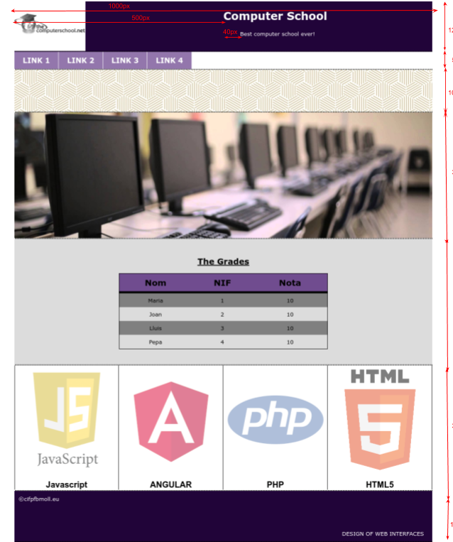

# DIW exercises

In this repository I will storing DIW exercises, each task will be in a different branch.

DIW stands for *Diseny d'Interficies Web*

In the issues section will be doubts and questions for the teacher.

## Instructions

Create the webpage you can see in this image with the same measures. The layout must have a layout with a minimum width of 1050px. It doesn’t need to be responsive.
Here you have a full size capture of the final result.

### Result

  

**Page - General settings**

 - The page has a 1200px width approximately
   - The contents of the website must be centered according to the sides of the viewport
 - The page is divided into 7 parts, every part is separated by a dashed border 
 - Font must be Verdana and sized 13px for all the website
 - Use the *pick color* tool to capture the colors of the layout
 - Write the styles in an external style sheet ,  inserting  id  and  class  in the HTML5 code when needed

> The styles and measures that are not indicated in the following lines, must be created as similar as possible to the image

 1. **Header**
    - Set the logo image using background-image property 
    - “The Computer School” is an h1 and its font is double size of the body font size
 2. **Menu**
    - Create the sections of the menu using an unordered list modified (`<ul> <li>` ).  Tip: [https://www.w3schools.com/Css/css_navbar.asp](https://www.w3schools.com/Css/css_navbar.asp)
    - Every section of the menu has:
      - A font size 30% bigger than the body font
      - Vertical padding of 10px 
      - Horizontal padding of 20px

 3. **Pattern**
    - Use the background-image and the image available in images to create this pattern

 4. **Central image**
    - Use the image available in images
    - The image must have exactly the same proportions and look as in [here](docs/webpage.png) (Use the layout properties we’ve seen in class make it look exactly like that)

 5. **The Grades**
    - The table must be exactly as it appears

 6. **Angular, HTML, PHP, Javascript**
    - Use the tag `` to insert the four images. 
    - The images must be horizontally centered
    - The texts under the images have a 20px size and are bold
    - On the left and on the right of every image there’s a single border of 1px

 7. **Footer**
    - Use only one `
`, two `` and make use of position:absolute to put one text on the top left corner and the other text on the bottom right corner

 8. **Validate the HTML5 document**
    - You must always validate your ’HTML5 andl CSS3. You can use the extension V3C Validation for VSC

 9. **Create vendor prefixes**
    - Create the vendor prefixes (-moz, -ms, etc) for your CSS3. 
      - Use a VSC extension !

> Remember that the exercices are not mandatory but I strongly advise you to do them in order to practice, as any of them they can appear in the Trimestral Exam

###### Teacher @classicoman2

###### Jose María Samos Diago